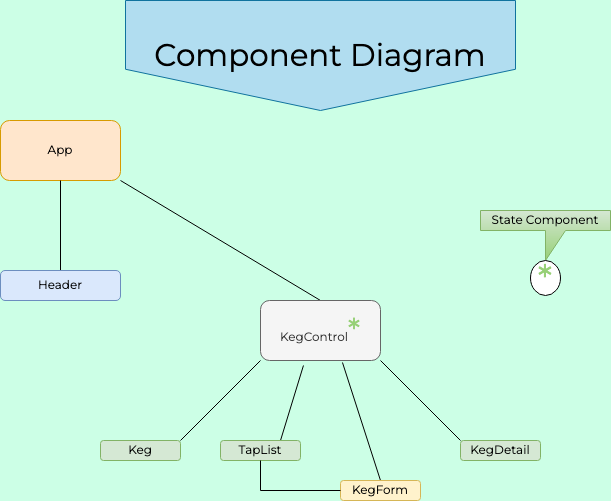

# Taproom AKA Bubbles!

   Simple React web application (with partial CRUD functionality) for a beer taproom to manage their kegs and beer sales.

## Created By:

  _Tim Roth_
  
## User Stories

|  # 	|  Stories 	|
|---	|---	|
|  1 	|  A user should be able to Create, Update, and see a list of and details of kegs in the tap room. 
|  2 	|   Decrease kegQuantity by 1 fraction of the total every time a pint of beer is sold. 
|  3 	|   When the keg is empty (zero portions remaining), the app should return "That beer has been drunk!" and the app will not allow any further pint sales.
|  4 	|   When the keg is emptied, the user should be given the option to restock the keg.	|
|  5 	|   New keg form should have fields for beer name, brewery, price, ABV (alcohol by volume) and pints per keg.	|
|  6	|   The user should be able to see how many pints are left in a keg.	|

## Technologies used:

- [VS Code](https://code.visualstudio.com/download)
- Git & GitHub
- ES6 JavaScript
- JSX
- React Framework v17.0
- npm
- node.js
- `create-react-app`
- `npm install --save-exact react-scripts@3.2.0`
- webpack 
- Babel
- ESLint
- node.js v15.8.0
- Bootstrap v5.0.0

## Component Diagram

 

## Setup/Installation Requirements

1. Download or clone the [https://github.com/phantomcurve/Taproom.git](https://github.com/phantomcurve/Taproom.git) to your local machine.

2. Open the repository in your preferred code editor

3. Make sure Node is enabled and installed on your machine, as you will otherwise be unable to run the standard NPM scripts in React 

4. Open either your root terminal or the terminal in your code editor and run `NPM Install`

5. Once the install has completed, run `NPM Start` to run the program–this should prompt your default browser to open a tab for http://localhost:3000/.

## Known bugs

* Some buttons don't appear with borders because my styling with React needs more practice!

## License information with a copyright and date:

MIT License

Copyright (c) 2021 

Permission is hereby granted, free of charge, to any person obtaining a copy of this software and associated documentation files (the "Software"), to deal in the Software without restriction, including without limitation the rights to use, copy, modify, merge, publish, distribute, sublicense, and/or sell copies of the Software, and to permit persons to whom the Software is furnished to do so, subject to the following conditions:

The above copyright notice and this permission notice shall be included in all copies or substantial portions of the Software.

THE SOFTWARE IS PROVIDED "AS IS", WITHOUT WARRANTY OF ANY KIND, EXPRESS OR IMPLIED, INCLUDING BUT NOT LIMITED TO THE WARRANTIES OF MERCHANTABILITY, FITNESS FOR A PARTICULAR PURPOSE AND NONINFRINGEMENT. IN NO EVENT SHALL THE AUTHORS OR COPYRIGHT HOLDERS BE LIABLE FOR ANY CLAIM, DAMAGES OR OTHER LIABILITY, WHETHER IN AN ACTION OF CONTRACT, TORT OR OTHERWISE, ARISING FROM, OUT OF OR IN CONNECTION WITH THE SOFTWARE OR THE USE OR OTHER DEALINGS IN THE SOFTWARE.

## Contact information:
   
* timdroth@gmail.com

## Available Scripts

In the project directory, you can run:

### `npm start`

Runs the app in the development mode.\
Open [http://localhost:3000](http://localhost:3000) to view it in your browser.

The page will reload when you make changes.\
You may also see any lint errors in the console.

### `npm test`

Launches the test runner in the interactive watch mode.\
See the section about [running tests](https://facebook.github.io/create-react-app/docs/running-tests) for more information.

### `npm run build`

Builds the app for production to the `build` folder.\
It correctly bundles React in production mode and optimizes the build for the best performance.

The build is minified and the filenames include the hashes.\
Your app is ready to be deployed!

See the section about [deployment](https://facebook.github.io/create-react-app/docs/deployment) for more information.

### `npm run eject`

**Note: this is a one-way operation. Once you `eject`, you can't go back!**

If you aren't satisfied with the build tool and configuration choices, you can `eject` at any time. This command will remove the single build dependency from your project.

Instead, it will copy all the configuration files and the transitive dependencies (webpack, Babel, ESLint, etc) right into your project so you have full control over them. All of the commands except `eject` will still work, but they will point to the copied scripts so you can tweak them. At this point you're on your own.

You don't have to ever use `eject`. The curated feature set is suitable for small and middle deployments, and you shouldn't feel obligated to use this feature. However we understand that this tool wouldn't be useful if you couldn't customize it when you are ready for it.

## Learn More

You can learn more in the [Create React App documentation](https://facebook.github.io/create-react-app/docs/getting-started).

To learn React, check out the [React documentation](https://reactjs.org/).

### Code Splitting

This section has moved here: [https://facebook.github.io/create-react-app/docs/code-splitting](https://facebook.github.io/create-react-app/docs/code-splitting)

### Analyzing the Bundle Size

This section has moved here: [https://facebook.github.io/create-react-app/docs/analyzing-the-bundle-size](https://facebook.github.io/create-react-app/docs/analyzing-the-bundle-size)

### Making a Progressive Web App

This section has moved here: [https://facebook.github.io/create-react-app/docs/making-a-progressive-web-app](https://facebook.github.io/create-react-app/docs/making-a-progressive-web-app)

### Advanced Configuration

This section has moved here: [https://facebook.github.io/create-react-app/docs/advanced-configuration](https://facebook.github.io/create-react-app/docs/advanced-configuration)

### Deployment

This section has moved here: [https://facebook.github.io/create-react-app/docs/deployment](https://facebook.github.io/create-react-app/docs/deployment)

### `npm run build` fails to minify

This section has moved here: [https://facebook.github.io/create-react-app/docs/troubleshooting#npm-run-build-fails-to-minify](https://facebook.github.io/create-react-app/docs/troubleshooting#npm-run-build-fails-to-minify)
